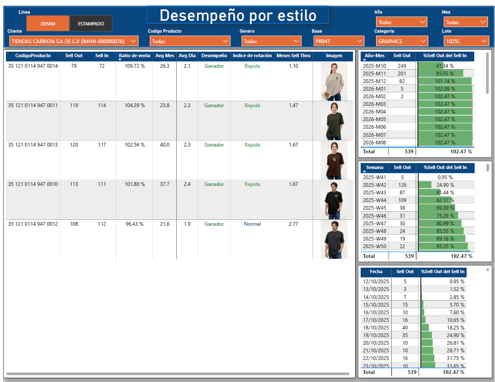

# 🎨📊 Sales Performance Dashboard – Design Department (Power BI)

## 🚀 Project Overview

This project was developed in **Power BI** for the **Design Department**, who needed visibility into which product styles were performing well and which ones were not.

Designers wanted to clearly understand:

- Which styles are 🏆 *winning*
- Which are ⚖️ *average performers*
- Which are 🗑️ *obsolete*
- How fast products are rotating in inventory
- How long it takes for a product to reach a specific sales percentage

The result is a **1-page interactive dashboard** that allows them to filter and analyze product performance dynamically.

---

## 🎯 Business Objective

Enable the design team to:

- Identify top-performing styles
- Detect slow-moving products early
- Analyze inventory rotation speed
- Make data-driven design and production decisions

---
### 🔎Preview

---
## 🧩 Main Features

### 🔎 Dynamic Filters

Users can filter by:

- Genre
- Category
- Lote
- Client
- Line

This allows designers to analyze specific product segments easily.

---

### 🏷️ Product Performance Classification

Each product is classified based on how long it takes to reach 100% sales:

| Category | Definition |
|----------|------------|
| 🏆 **Winner** | Sold 100% within **3 months** |
| ⚖️ **Medium** | Sold 100% within **5 months** |
| 🗑️ **Obsolete** | Took **7+ months** to sell |

This metric helps quickly identify successful vs slow-moving designs.

---

### 🔄 Inventory Rotation Index

A custom metric was created to measure how fast inventory rotates.

This allows the team to:

- Understand sales velocity
- Compare product performance
- Detect inefficient inventory turnover

---

### 🖼️ Product Image Integration

The main table includes:

- Product photo
- Sales percentage
- Performance classification
- Rotation metrics

This helps designers visually connect performance with the exact design.

---

### 📅 Time-to-Performance Breakdown

On the right side of the dashboard, three additional tables show:

- 📆 Months
- 📅 Weeks
- ⏳ Days

These tables indicate how long it took for a product to reach a selected sales percentage.

They include **conditional formatting**, where:

🟢 A progress bar fills in green as the sales percentage increases.

Example:
If a product has sold **70%**, the user can see exactly:

- How many months
- How many weeks
- How many days

it took to reach that 70%.

---

## 📊 Key Concepts Applied

- DAX calculated measures
- Inventory turnover logic
- Conditional formatting
- Dynamic filtering
- Business rule-based classification
- Visual storytelling with data
- Image integration in Power BI tables

---

## 💡 Business Impact

This dashboard allows the Design Department to:

- Reduce slow-moving inventory
- Improve future design decisions
- Identify winning patterns in styles and attributes
- Support data-driven creative strategy

---

## 🛠️ Tools Used

- Power BI
- DAX
- Data modeling
- Inventory performance metrics

---
### 📅 Measures
Average month:

Avg Mes = 
AVERAGEX(
    VALUES(DimFechas[Mes]),
    [Total Sell Out]
)

Average day:

Avg Día = 
AVERAGEX(
    VALUES(DimFechas[Fecha]),
    [Total Sell Out]
)

Desempeño:

Desempeño = 
SWITCH(
    TRUE(),
    [% Sell Out del Sell In] > 0.8, "Ganador",
    [% Sell Out del Sell In] > 0.5, "Normal",
    "Obsoleto"
)

% vendido:

% Acum Sell Out del Sell In = 
VAR _sellIn = CALCULATE([Unids Facturadas Clientes], ALLSELECTED(DimFechas[AñoMes]))
RETURN DIVIDE([Total Sell Out Acumulado],_sellIn,0)

---

## 📌 Author

**Bryan Orellana**  
Business Intelligence Analyst  
Focused on transforming business questions into actionable insights 📈

---

⭐ If you found this project interesting, feel free to explore the report and the DAX logic included in this repository.
